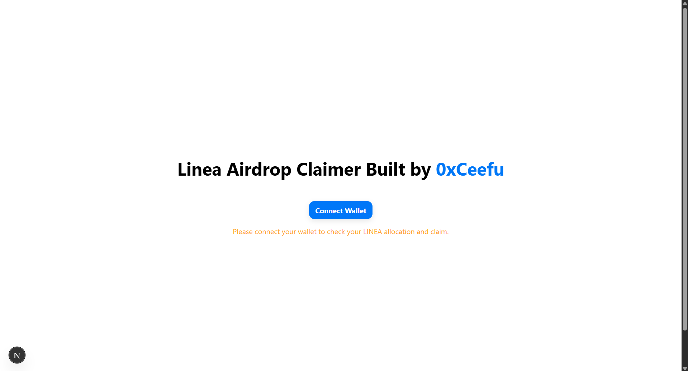

# Linea Airdrop Claim DApp

A decentralized application (DApp) for claiming Linea airdrop tokens. Built with RainbowKit, wagmi, and Next.js, this project allows users to connect their wallet, check their Linea token allocation, and claim tokens if eligible.



## Features
- Connect your wallet using RainbowKit
- Check your Linea token allocation
- Claim airdrop tokens if eligible
- Transaction status and error handling

## Technologies Used
- [RainbowKit](https://rainbowkit.com) – Wallet connection UI
- [wagmi](https://wagmi.sh) – Ethereum React hooks
- [Next.js](https://nextjs.org/) – React framework
- [TypeScript](https://www.typescriptlang.org/) – Type safety

## Getting Started

1. Clone the repository:
   ```bash
   git clone https://github.com/yourusername/linea-airdrop-claim.git
   cd linea-airdrop-claim
   ```

2. Install dependencies:
   ```bash
   npm install
   ```

3. Set up environment variables:
   - Copy `.env.local.example` to `.env.local` and add your RainbowKit project ID:
     ```env
     NEXT_PUBLIC_PROJECT_ID=your_project_id_here
     ```

4. Run the development server:
   ```bash
   npm run dev
   ```

5. Open [http://localhost:3000](http://localhost:3000) in your browser.

## Usage
- Connect your wallet using the Connect button.
- View your Linea token allocation.
- If eligible, click "Claim Airdrop" to claim your tokens.
- Transaction status and errors will be displayed.

## Screenshot
Add a screenshot of the app UI to `public/screenshot.png`.

## Learn More
- [RainbowKit Documentation](https://rainbowkit.com)
- [wagmi Documentation](https://wagmi.sh)
- [Next.js Documentation](https://nextjs.org/docs)

## License
MIT
